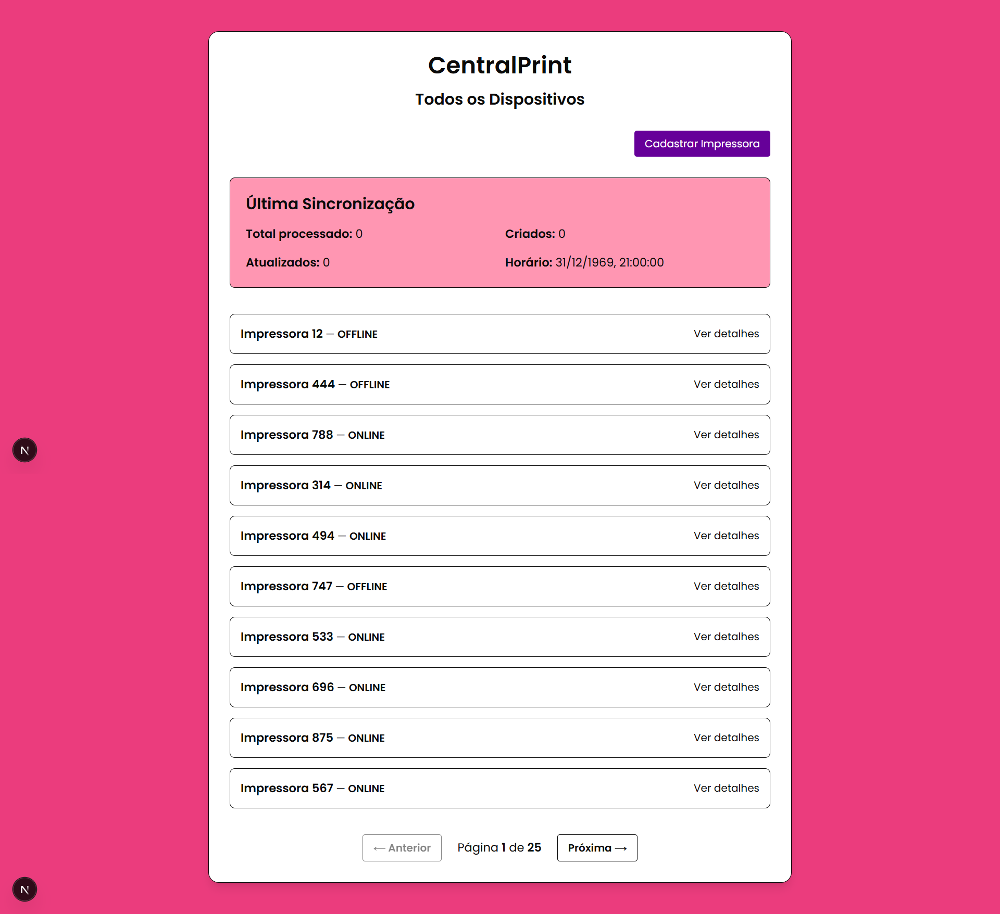
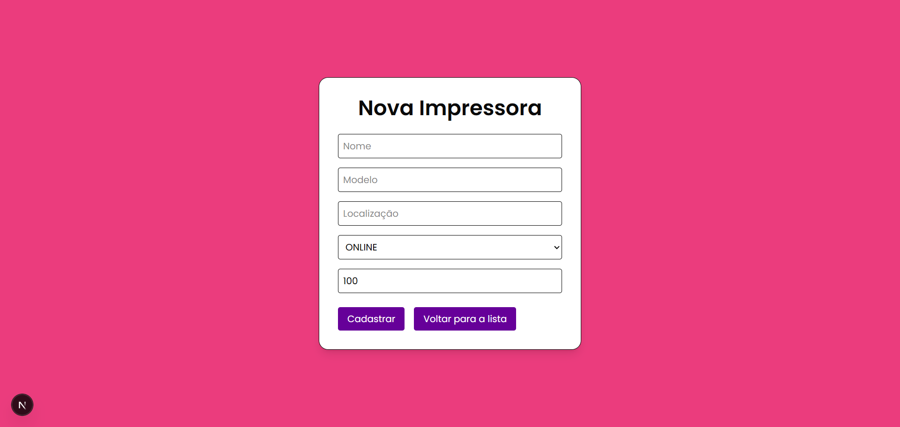
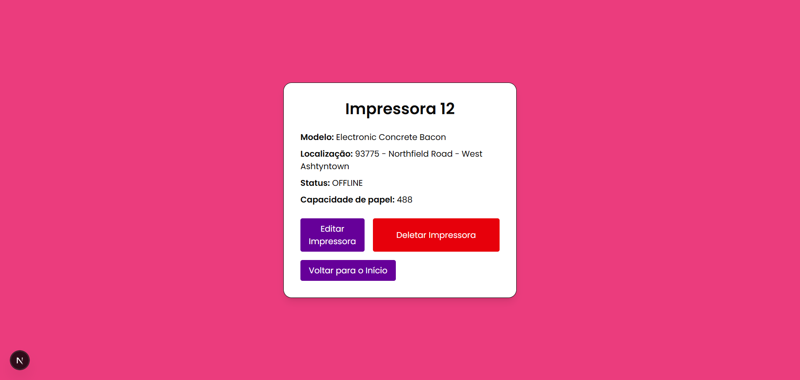
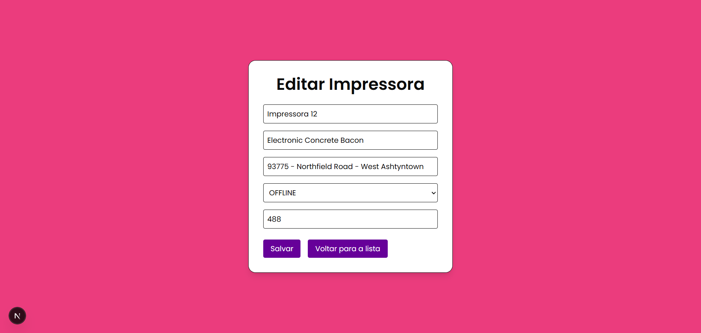

# 🖨️ CentralPrint – Desafio Técnico

Sistema de gestão de impressoras corporativas desenvolvido com abordagem fullstack, com backend SpringBoot e frontend Next.js. Projeto desenvolvido como desafio de habilidades técnicas.

---

## Sumário
- [Funcionalidades](#funcionalidades)  
- [Tecnologias utilizadas](#tecnologias-utilizadas)  
- [Arquitetura do projeto](#arquitetura-do-projeto)  
- [Lista de endpoints](#lista-de-endpoints)  
- [Como rodar](#como-rodar)
- [Testes Postman](#testes-postman)  
- [Capturas de Tela](#capturas-de-tela)  
- [Créditos](#créditos)  

---

## Funcionalidades
- CRUD básico de impressoras para administração.
- Sincronização automática das impressoras com a API a cada 1 hora.
- Registro de estatísticas da última sincronização.

---

## Tecnologias utilizadas
- Node.js
- Java
- Spring Boot  
- MySQL
- WebClient (Spring WebFlux)
- Validação de formulários com Zod
- Next.js
- Maven
- Docker (versão dockerizada na branch 'develop')

---

## Arquitetura do projeto
```bash
📂 printer-management-system/
├── 📂 backend/
│   ├── 📂 src/
│   │   ├── 📂 main/
│   │   │   ├── 📂 java/
│   │   │   │   └── 📂 com/
│   │   │   │       └── 📂 printers/
│   │   │   │           └── 📂 printerManagementSystem/
│   │   │   │               ├── 📂 controller/
│   │   │   │               │   └── 📄 PrinterController.java               # rotas /printers
│   │   │   │               │   └── 📄 SyncController.java                  # rotas /sync
│   │   │   │               ├── 📂 dto/
│   │   │   │               │   └── 📄 PrinterExternalDTO.java              # representa os dados de uma impressora recebidos de uma API externa
│   │   │   │               │   └── 📄 PrinterResponseWrapper.java          # encapsula a resposta da API externa contendo o total e a lista de impressoras
│   │   │   │               │   └── 📄 PrinterStatusDTO.java                # representa o status atual e o nível de papel de uma impressora
│   │   │   │               │   └── 📄 SyncStatisticsDTO.java               # armazena estatísticas da última sincronização de impressoras com a API externa
│   │   │   │               ├── 📂 model/
│   │   │   │               │   └── 📄 Printer.java                         # modelo de impressora
│   │   │   │               │   └── 📄 PrinterStatus.java                   # modelo de status de impressora
│   │   │   │               ├── 📂 repository/
│   │   │   │               │   └── 📄 PrinterRepository.java               # repositório para interações com a tabela 'printer' do BD
│   │   │   │               ├── 📂 service/
│   │   │   │               │   └── 📄 PrinterService.java                  # serviços para listar, buscar, criar, atualizar e deletar impressoras no sistema
│   │   │   │               │   └── 📄 PrinterSyncService.java              # servições para sincronização com a API externa
│   │   │   │               └── 📄 PrinterManagementApplication.java        # core da aplicação backend
│   │   │   └── 📂 resources/
│               └── 📂 static/
│               └── 📂 templates/
│               └── 📄 application.properties                               # configurações do Spring Boot para conexão com banco MySQL, nome da aplicação e logs
│   │   ├── 📂 test/
│   └── 📄 pom.xml                                                          # dependências
├── 📂 docs/
│   └── 📄 nextjs.md                                                        # documentação do Next.js
│   └── 📄 spring-initializr.md                                             # documentação do Spring Initializr
│   └── 📄 test-description.md                                              # descrição do desafio técnico
├── 📂 frontend/
│   ├── 📂 public/
│   ├── 📂 src/
│   │   └── 📂 app/
│   │       ├── 📂 printers/
│   │           ├── 📂 [id]/
│   │               ├── 📂 edit/
|   |               └── 📄 page.tsx                                         # página de edição de impressora
│   │       ├── 📂 register/
|   |           └── 📄 page.tsx                                             # página de cadastro de impressora
|   |       └── 📄 flavicon.ico
|   |       └── 📄 globals.css
|   |       └── 📄 layout.tsx
|   |       └── 📄 page.tsx                                                 # página principal
│   │   └── 📂 components/
|   |       └── 📄 Button.tsx
│   └── 📄 eslint.config.mjs
│   ├── 📄 next.config.js
│   └── 📄 package.json
│   └── 📄 package-lock.json
│   └── 📄 postcss.config.json
│   └── 📄 tailwind.config.json
📄 CentralPrint-Testes.postman_collection                                   # testes postman
📄 README.md
```

---

## Lista de endpoints

| Método | Endpoint                  | Descrição                      |
|--------|---------------------------|--------------------------------|
| GET    | /api/v1/printers          | Lista todas as impressoras     |
| GET    | /api/v1/printers/{id}     | Obtém detalhes da impressora   |
| POST   | /api/v1/printers          | Cadastra nova impressora       |
| PUT    | /api/v1/printers/{id}     | Atualiza impressora existente  |
| DELETE | /api/v1/printers/{id}     | Remove impressora              |
| GET    | /api/v1/printers/{id}     | Status da impressora           |
| GET    | /api/v1/printers/{id}     | Estatísticas da API            |

---

## Como rodar

#### Pré-requisitos
Antes de rodar o projeto, tenha certeza de ter instalados:
- Java
- Node.js
- MySQL
- IDE para backend (como IntelliJ ou VS Code)  
- Gerenciador de pacotes Maven (para o backend)
- DBeaver (para checagem do banco de dados - opcional)
- Postman (para testes - opcional)

### Clone o repositório
```bash
git clone https://github.com/beaalmeidas/desafio-tecnico-m4all.git
```

### Backend (Spring Boot)
OBS.: Abra a pasta do projeto em um terminal com permissões de administrador.

```bash
cd printer-management-system/backend
mvn clean install
./mvnw spring-boot:run
```

### Frontend (Next.js)

```bash
cd printer-management-system/frontend
npm install
npm run dev
```

A aplicação estará rodando na porta http://localhost:3000/

---

## Testes Postman
Importe a coleção Postman disponibilizada para testar os endpoints da API.

---

## Capturas de Tela

<div align="center">

<table>
  <tr>
    <td align="center">
      <strong>Tela Principal</strong><br>
      
    </td>
    <td align="center">
      <strong>Tela de Cadastro</strong><br>
      
    </td>
  </tr>
  <tr>
    <td align="center">
      <strong>Tela de Detalhes</strong><br>
      
    </td>
    <td align="center">
      <strong>Tela de Edição</strong><br>
      
    </td>
  </tr>
</table>

</div>

---

## Créditos
Beatriz Almeida de Souza Silva
Julho de 2025
